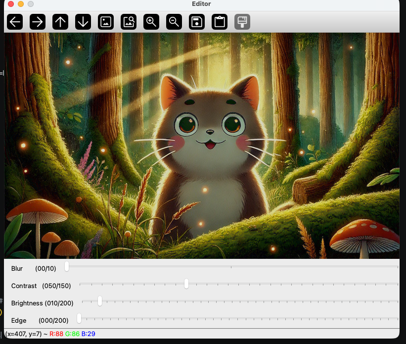

# iot-python-2026
파이썬 학습 리포지토리

- 참고자료 : https://wikidocs.net/book/18202


## 1일차


### 사전정리

기본 문법,
- 변수, 데이터형
- 제어문
  - 조건문
  - 반복문
- 함수/메서드
- 배열
- 포인터/참조
- 구조체/클래스
- 파일 입출력
- 예외처리

### 이론적 개념 정리
#### 파이썬에 신경 안써도 되는 것
- 학습 난이도를 낮추는 목록
  - 자료형 선언 안함
  - 세미콜론 없음
  - 중괄호 없음 - 들여쓰기 해야함
  - main함수 생성 강제 아님
  - 메모리 할당 해제 거의 안함 - 가비지 컬렉터가 자동으로
  - 헤더 파일 개념 없음
  - 컴파일 과정 신경 거의 안씀
  - 개발환경 설정 어렵지 않다


- 문법 비교표

| 항목 | C++ | Python |
| :--- | :--- | :--- |
| **기본 구조** | 중괄호 `{ }`, 세미콜론 `;` 필수 | 들여쓰기(Indentation), 줄바꿈 구분 |
| **변수 선언** | `int x = 10;` (정적 타이핑) | `x = 10` (동적 타이핑) |
| **출력** | `std::cout << "Hello";` | `print("Hello")` |
| **조건문** | `if (x > 0) { ... }` | `if x > 0:` |
| **반복문 (For)** | `for (int i=0; i<10; i++)` | `for i in range(10):` |
| **함수 정의** | `int func(int a) { return a; }` | `def func(a): return a` |
| **배열/리스트** | `std::vector<int> v;` | `v = [1, 2, 3]` |
| **불리언** | `true`, `false` | `True`, `False` |
| **메모리 관리** | 수동 (Smart Pointer 권장) | 자동 (Garbage Collection) |


### 환경설정
- 미니 콘다 설치
- 주피터 설치
- 가상환경 활성화
- 파이썬 설치
- opencv 설치
- 파이토치 설치
- 주피터 랩 실행
- 테스트


#### 가상환경 주의점
- 파이토치 사용시 PyTorch가 내부적으로 사용하는 OpenMP 라이브러리와 시스템의 다른 라이브러리가 충돌하면서 발생하는 전형적인 문제발생 
- import os
- os.environ['KMP_DUPLICATE_LIB_OK'] = 'True' 파일 최상단에 삽입하여
- 오류 무시


### 파이썬 기본 학습
1. 기본입출력[text](day1/ex01_output.py)
   - py 파일 작성
   - ctrl + f5 실행
   - 디버거 선택
2. 리스트[text](day1/ex02_array.py)
- 어떤 데이터 타입도 추가 가능
- append ~ sort까지 11개 함수만 학습

3. 제어문[text](day1/ex03_logic_control.py)
   - if, for
   - switch-case 많음


## 2일차

### 파이썬 기본학습
4. 변수, 자료형
   - 선언이 없고 자료형을 지정안함
   - 자료형 자체를 사용안함, 형변환 필요
   - 기본자료형, int, float, str, bool, Nontype(null과 비슷)
5. 연산자
  - 사칙연산, 할당연산, 비교연산, 논리연산, 멤버십연산
  - 연산자 우선순위 : 거듭제곱 > 곱셈, 나눗셈 > 덧셈, 뺄셈
6. 문자열
   - c방식 문자열 처리가능
   - 여러 문자열 출력방식 존재, f-string 사용 추천
   - 포맷팅 기법
7. 함수
   - 객체지향언어 함수 -> 메서드로 호칭
   - 파이썬은 함수로 호칭
   - c와 유사하게 함수 사용전에 호칭
   - def로 선언 파라미터 괄호 뒤 : 사용
8. 파일입출력
   - c/c++과 모드가 동일 r,w,a
   - with 구문으로 close생략 가능
   - 쓰기 각 문장 끝 \n 추가 해야함
   - 기본적으로 utf-8
   - json, csv, 텍스트 파일 등 읽기에 많이 사용 

9. 여기까지 배우고 활용하는 분야도 존재
   - 데이터분석, 머신러닝/딥러닝
10. 연습
    - 구구단
    - 자판기
11. 라이브러리 사용
    - 파이썬 표준 라이브러리 - 파이썬에 포함된 기본 라이브러리
    - 외부 라이브러리 - pip로 설치하는 3rd-party에서 개발된 라이브러리
    - import로 호출해서 사용
    - from ~improt ~ : 클래스명만 기재
    - 라이브러리(모듈).클래스.함수() 형태로 존재
## 3일차
### 파이썬 기본 학습
11. 라이브러리 사용[소스](day3/ex11_out_package.py)
   - 계속 타언어의 경우 웹 검색, 다운로드, 개발위치 설치나 복사 
   - cpu 아키텍처에 따라 32, 64 마다 설치 방법 상이
   - 파이썬은 자신만의 패키지 관리자 pip 사용
   - 웹 검색 후 pip 명령어로 각 파이썬 개발 환경에 맞춰서 설치 
   - 패키지 > 라이브러리 > 모듈
   - csv 라이브러리 [소스](day3/ex12_csv_package.py)
12. 기타 자료구조[소스](day3/ex13_datastruct.py)
   - 리스트 외 튜플, 딕셔너리, 셋

13. main[소스](day3/ex14_main.py)
   - 파이썬은 main함수가 필요없음
   - 여러 파일 중 시작점을 지칭할 때는 사용
   - __name__ 특수 변수를 사용

14. 가상환경
   - 프로젝트 마다 파이썬 환경을 따로 사용하기 위해 만들어진 개념
   - 프로젝트 생성 시 독립된 파이썬, 라이브러리 세트 새로 생성
``` bash
> python -m venv 가상환경이름

```
   - 가상환경을 프로젝트 폴더에 생성하면 .gitignore에 가상환경 폴더를 추가 해줘야함


15. 객체지향[소스](day3/ex15_oop1.py)
   - new 안씀, 변수등 선언 제약사항이 많이 없음
   - 클래스 내의 모든 함수의 파라미터는 self로 시작, c++의 this 와 동일
   - 호출시에는 self를 사용
   - public, private : __ 를 앞에 붙여서 프라이빗 변수선언, protected : _ 를 앞에 붙여서 사용


16. 예외처리

- 예외 처리 기본 구조
| 키워드 | 역할 | 특징 |
| :--- | :--- | :--- |
| **`try`** | 에러 감시 | 에러가 발생할 가능성이 있는 코드만 작성 |
| **`except`** | 에러 처리 | 특정 에러 발생 시 실행 (구체적 명시 권장) |
| **`else`** | 정상 실행 | 에러가 발생하지 않았을 때만 실행 |
| **`finally`** | 무조건 실행 | 에러 여부와 상관없이 자원 해제(Close) 시 사용 |

- 실무 활용 원칙
* **구체적 명시**: `except:` 대신 `except ValueError:` 처럼 에러 이름을 정확히 기재.
* **계층 구조**: 하위 예외(Specific)를 먼저 쓰고, `Exception`(Generic)을 나중에 배치.
* **최소 범위**: `try` 블록 안에는 에러가 날 법한 코드만 최소한으로 삽입.
* **강제 발생**: `raise`를 사용하여 비즈니스 로직상의 오류를 직접 발생시킴.
---

- 주요 예외 클래스 종류
* **`SyntaxError`**: 문법 오류
* **`NameError`**: 선언되지 않은 변수 사용
* **`TypeError`**: 데이터 타입 부적합
* **`IndexError`**: 리스트/튜플 인덱스 범위 초과
* **`ValueError`**: 값의 타입은 맞으나 내용이 부적절
* **`KeyError`**: 딕셔너리에 없는 키 참조
* **`AttributeError`**: 객체에 없는 속성/메서드 호출
* **`FileNotFoundError`**: 파일 경로 오류

### 파일 입출력
- 인코딩
  - euc-kr : 2바이트 한글 완성형 인코딩(cp949)
  - utf-8 : 1바이트 영문(아스키 호환) 3바이트 한글, 4바이트 이모지 등 최대 4바이트 이용하는 국제어표준
  - 대한민국 데이터 포털에서 제공하는 csv는 euc-kr 사용중, utf-8 변환 필요 
- csv
  - 엑셀과 호환가능한 텍스트파일
  - 파일이 많으면 한줄씩 나눠서 읽어야함
 
- json
  - javascript object notation : 자바스크립트에서 데이터를 사용하기 위해 만든  표기방법
  - 딕셔너리를 텍스트화
  - 데이터를 네트워크로 전달할때 가장 효율적인 파일 형식
  - xml을 대체하는 기술


### 주피터 노트북 [소스](day3/ex20_jupyter_start.ipynb)
- 주피터 노트북 
   - 파이썬을 좀 더 파이썬 답게 사용할 수 있음
- 사용법
   - 주피터랩 설치후 콘솔에서 jupyter lab 입력, vscode 확장 설치해서 사용
   - 마크다운셸, 코드 셸로 구분
- 주피터 노트북 단축키
   - a : 현재 셸 위에 코드셸 추가  
   - b : 현재 셸 아래에 코드셸 추가 됨 
   - enter : 현제 편집 모드로 진입
   - ctrl_ enter : 마크다운 빠져나오기, 코드셸 실행
   - l : 셸선택모드에서 라인번호 표시 토글
   - dd : 셸삭제
### 데이터 분석 기초 [소스](day3/ex21_dataprocess.ipynb)
- 분석이나 기초 이론
  - 리스트 컴프리헨션
  - 파일 입출력
  - Numpy
  - Pandas 
  - Matplotlib
  - Seaborn
  - Foluim
  - WordCloud
  - 기초통계
  - 데이터전처리


## 4일차
### 데이터 분석 기초 계속 [text](day4/ex22_dataprocess.ipynb)
  - Numpy
  - Pandas 
  - Matplotlib
  - Seaborn - [노트북](day4/ex23_dataprocess.ipynb)
  - Folium  - [노트북](<day4/ ex24_map_vis.ipynb>)
  - WordCloud - [노트북](day4/ex25_worldcloud.ipynb)
  - [기초통계](#기초-통계)
  - 데이터전처리
- 데이터 분석
  - 인사이트 : 특정ㅎ나 맥락 속에서 특정원인이나 효과를 이해하는 것
  - 방대한 데이터 속에서 패턴이나 인사이트를 도출, `합리적인 의사결정`, `고객 행동 예측`, `운영 효율화 `. `신규비즈니스 기회 창출 ` 등을 하는 핵심 도구
    - 데이터 기반의 의사결정 가능
    - 고객이해도 증가
    - 운영 효울성 및 비용 절감
    - 트렌드 파악 및 경쟁력 강화
    - 미래 예측

#### 기초 통계
- 기초 통계
  - 평균 - 데이터의 합을 데이터 수로 나눈 것
  - 중앙값 - 평균과 달리 전체 데이터의 중앙값을 나타내는 값
  - 최빈값 - 가장 많이 나온값
  - 분산 - 데이터가 얼마나 퍼져 있는지 평균으로부터 거리의 평균
  - 표준편차 - 데이터의 흩어짐 정도를 산출
  - 최대값/최소값 - 데이터의 가장 큰 값과 가장 작은 값
  - 사분위수 - 데이터를 4등분 q1(25%), q1(50% median), q3(75%) q4(100%)
  - 상관계수 - 두 데이터의 관계 1(강한 양의 관계) 0(관계 없음), -1(강한 음의 관계(반대))
  - 정규분포 - 현재의 값이 정상범위인지 판단할때
  - 이상치 - 튀는 값

- 데이터 전처리
  - 분석/ 모델 처리전 데이터를 정리하는 과정
    - 전체 데이터분석의 시간 60~80% 까지 전처리에 사용
    - 도메인(특정 비즈니스)에 따라 이해도
    - 수정하고 틀리면 또 수정...
  - 현실 데이터의 문제
    - 데이터 구조가 제각각(json, csv, db, ...)
    - 값이 비어 있음
    - 이상한 값이 있음
    - 단위도 제각각
    - 숫자와 문자가 뒤섞임 
    - 위와 같은 데이터를 분석이나 머신러닝 딥러닝에 넣으면 처리가 엉망이 됨
  - 전처리 핵심 4단계
    - 결측치 처리 
    - 이상치 처리
    - 스케일링
    - 인코딩
  - 결측치 처리
    - 전체 데이터에서서 10%정도의 결측치가 있으면 다른값 (평균, 최소 , 최대, 중앙 값 등)으로 채워 넣음 실무에서는 평균, 중앙값 많이 사용
    - 40$ 이상의 결측치를 가지면, 이 컬럼은 삭제 분석에서 제외
  - 이상치 처리 
    - 단순 제거 
    - 사분위수를 사용,통계 기반으로 제거
  - 스케일링
    - 값의 범위를 맞추는 것
  - 인코딩
    - 문자를 숫자로 변환
    - 예시 -  male, female은 분석이 불가능함 -> 남자는 0 여자는 1 로 바꿔서 처리함
   - one-hot encoding, male[1,0,0] , female[0,1,0] , child[0,0,1]


## 5일차
### 영상처리
- 개요
  - 이미지 프로세싱
  - 이미지를 컴퓨터 분석하고 변환하는 분야 
  - frame : 동영상에서 하나씩 변경되는이미지
  - FPS : frame per second 1초 뿌려지는 이미지수
  - 영상처리는 이밎 동영상 모두 분석하고 변환처리하는 것
  - 컴퓨터 비전 - 영상처리를 컴퓨터로 처리
### opencv
  - 오픈 소스 컴퓨터 비전 라이브러리 
  - 독립적os 플랫폼에서 사용가능
  - c로 개발 c++로 변경
  - 모든 언어에서 사용할 수 있도록 래핑 라이브러리가 존재 
#### opencv -Python [노트북](day5/ex26_opencv.ipynb)
  - 파이썬에 사용가능하도록 만든 래핑 라이브러리
  - 코드 간결, ai/딥러닝과 연결 쉬움, 데이터 분석 통합 가능
  - c++ opencv보다 속도가 느림 -> Pytorch로 속도 개선
  

- OpenCV 간단 이미지 에디터 - [소스](day5/ex27_editor.py)
  - 실행화면
  - 


## 6일차
### opencv
- 카메라 사용
- 얼굴 및 입모양, 모자이크
- qr인식 및 브라우저 띄우기
#### 웹캠 사용
- cap = cv2.VideoCapture(카메라 번호)
  - 카메라 번호로 사용할 카메라 선택
  - cap은 카메라와 연결하는 객체
- ret, img = cap.read() 
  - ret은 정보 가져오기 성공 여부(true, false)
  - img는 지금 순간의 이미지 정보
#### 얼굴 인식
- opencv 제공 라이브러리 사용
  - haarcascade_frontalface_default.xml
  - haarcascade_eye_tree_eyeglasses.xml
  - haarcascade_eye.xml
  - haarcascade_smile.xml
  - haarcascade_frontalcatface_extended.xml
